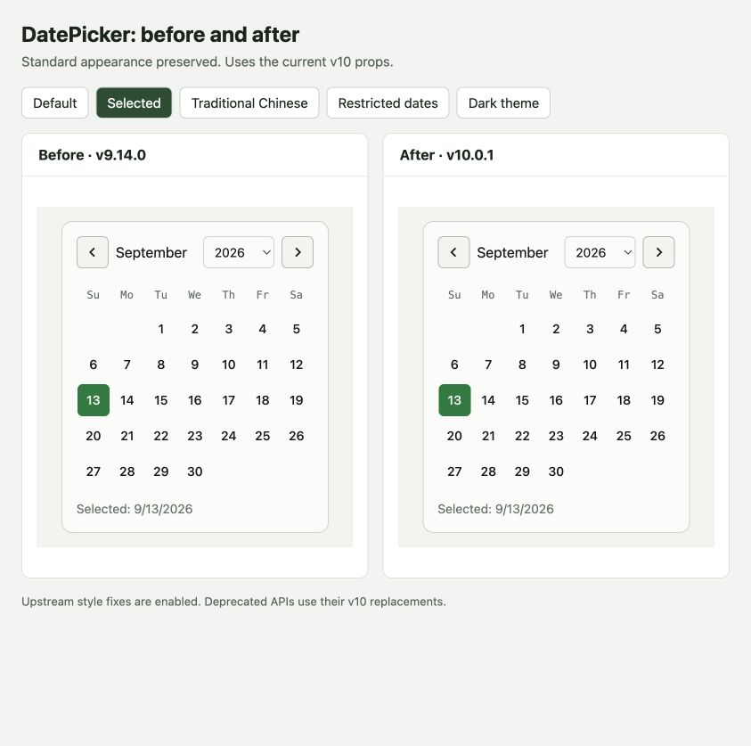
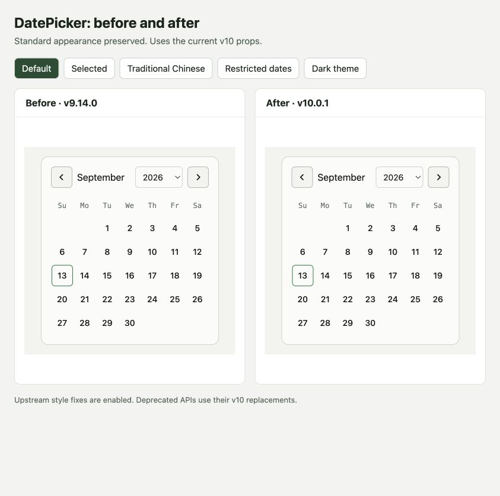
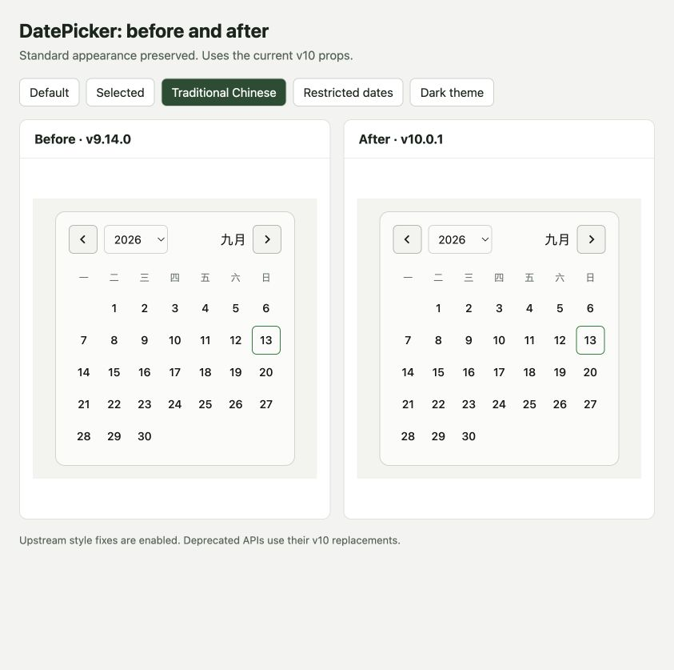
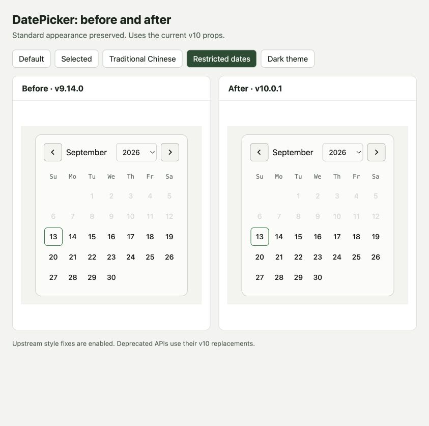
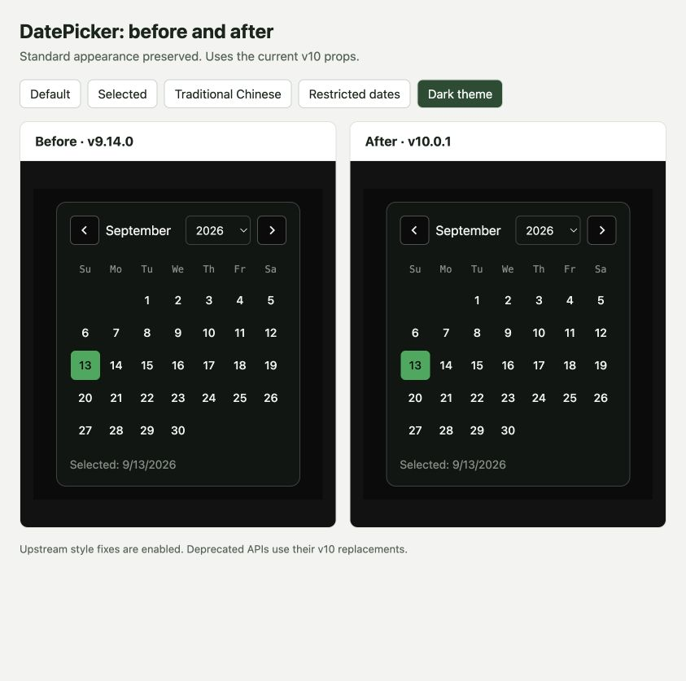

# DayPicker v10 migration

The local year dropdown now reads `components` and `classNames` through upstream `useDayPicker()`. `DatePickerProps` follows v10 `PropsBase` directly; no v9 compatibility layer or silently accepted obsolete props are retained.

The standard component styles and the `selected`, `onSelect`, and `required` contract remain unchanged. Upstream slot-style fixes are intentionally enabled.

## Screenshots

Latest upstream-native build compared with v9.14.0, using the same reference date and standard stories. Visual checks cover the five states below; custom slot-style changes are intentional.

### Selected date

### Default

### Traditional Chinese

### Restricted dates

### Dark theme

## Props and API migration

There are 60 supported top-level props, down from 76. The 16 removed keys were deprecated upstream. This is an intentional API break for callers using deprecated props, not a claim of complete v9 compatibility.

| Old API                                                                                                                                           | Supported replacement                                                     |
| ------------------------------------------------------------------------------------------------------------------------------------------------- | ------------------------------------------------------------------------- |
| `fromMonth`, `fromYear`                                                                                                                           | `startMonth`                                                              |
| `toMonth`, `toYear`                                                                                                                               | `endMonth`                                                                |
| `fromDate`, `toDate`                                                                                                                              | `hidden` date matchers; use `startMonth`/`endMonth` for navigation bounds |
| `initialFocus`                                                                                                                                    | `autoFocus`                                                               |
| `onWeekNumberClick`                                                                                                                               | Custom `components.WeekNumber`                                            |
| `onDayKeyUp`, `onDayKeyPress`, `onDayPointerEnter`, `onDayPointerLeave`, `onDayTouchCancel`, `onDayTouchEnd`, `onDayTouchMove`, `onDayTouchStart` | Custom `components.DayButton` with standard DOM event handlers            |
| `components.Button`                                                                                                                               | `components.PreviousMonthButton` and `components.NextMonthButton`         |
| Dropdown props `components` / `classNames`                                                                                                        | Read them using `useDayPicker()` inside the custom dropdown               |
| `formatters.formatMonthCaption`                                                                                                                   | `formatters.formatCaption`                                                |
| `formatters.formatYearCaption`                                                                                                                    | `formatters.formatYearDropdown`                                           |
| `labels.labelDay`                                                                                                                                 | `labels.labelDayButton`                                                   |
| Legacy style/class keys, e.g. `day_selected`                                                                                                      | Current keys, e.g. `selected`                                             |
| Imported `FormatOptions`                                                                                                                          | `DateLibOptions`                                                          |
| Imported `formatMonthCaption`                                                                                                                     | `formatCaption`                                                           |
| `new dateLib.Date(...)`                                                                                                                           | `dateLib.newDate(...)`                                                    |

## Styling behavior

`styles.button_previous`, `styles.button_next`, `styles.chevron`, and `styles.years_dropdown` now take effect as upstream intends. For example, red navigation button styles and a yellow year dropdown are shown after upgrading instead of being ignored. Callers wanting the existing default appearance should omit those overrides. The local dropdown preserves the merged generic and year-specific inline styles passed by DayPicker.

The package stays named `react-day-picker`, which remains supported in v10. Existing locale imports such as `react-day-picker/locale` are retained. No package-name migration is required for this fix.

## Verification

- Passed `pnpm verify:release` with 146 tests across 34 files: formatting, lint, TypeScript, component tests, package-consumer checks, React 18/19 checks, and Storybook build.
- Regression tests verify effective navigation/year-dropdown styles, current formatters, dropdown focus across rerenders, year navigation callbacks, and upstream dropdown overrides without leaked HTML attributes.
- The published-package consumer fixture uses the current date-library APIs and checks that representative obsolete props fail type checking.
- Existing selection, disabled dates, keyboard navigation, localization, controlled month, and hydration tests remain in place.

Upstream reference: [v10 upgrade guide](https://daypicker.dev/upgrading).
